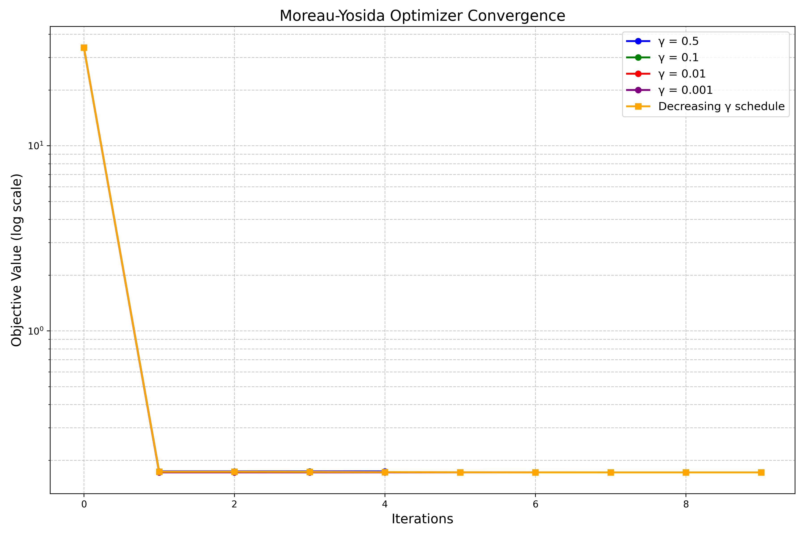
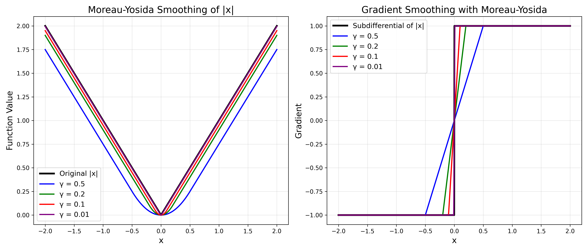

# Moreau-Yosida Regularization for Non-Smooth Optimization

## Overview

This repository implements Moreau-Yosida regularization for solving non-smooth optimization problems. The approach provides a differentiable approximation to non-smooth functions, enabling the use of standard smooth optimization techniques for problems that would otherwise require specialized methods.

## Mathematical Background

### The Moreau Envelope

For a function g, the Moreau envelope (or Moreau-Yosida regularization) with parameter γ > 0 is defined as:
<div align="center">


</div>

The minimizer y in this expression is called the proximal point and is computed using the proximal operator:

<div align="center">


</div>
The gradient of the Moreau envelope has a simple expression:

<div align="center">


</div>

### Key Properties

1. **Smoothness**: The Moreau envelope is differentiable everywhere, even when the original function g is not.
2. **Same minimizers**: The Moreau envelope has the same minimizers as the original function.
3. **Approximation quality**: As γ → 0, the Moreau envelope converges to the original function.
4. **Gradient smoothing**: The gradient of the Moreau envelope is a smoothed version of the subgradient of the original function.

## Implementation

The implementation consists of two main classes:

1. `MoreauYosida`: Implements the Moreau-Yosida regularization for a given function.
2. `MoreauYosidaOptimizer`: Solves composite optimization problems of the form min f(x) + g(x), where f is smooth and g is non-smooth.

### Key Functions

#### MoreauYosida Class

- `prox_point(x)`: Computes the proximal point for a given input.
- `value(x)`: Computes the value of the Moreau envelope.
- `gradient(x)`: Computes the gradient of the Moreau envelope.
- `hessian(x)`: Provides an approximation to the Hessian of the Moreau envelope.
- `hessian_vector_product(x, v)`: Computes the Hessian-vector product without forming the full Hessian.

#### MoreauYosidaOptimizer Class

- `optimize(x0, return_trajectory=False)`: Minimizes the composite objective using Moreau-Yosida regularization with a possible decreasing schedule for γ.

### Usage Examples

```python
import numpy as np
from MoreauYosida import MoreauYosida, MoreauYosidaOptimizer, soft_thresholding

# Define a LASSO problem
n_samples, n_features = 50, 20
X = np.random.randn(n_samples, n_features)
true_w = np.zeros(n_features)
true_w[:3] = [1.0, -0.5, 0.2]
y = np.dot(X, true_w) + 0.01 * np.random.randn(n_samples)

# Define objective components
f_smooth = lambda w: 0.5 * np.sum((np.dot(X, w) - y) ** 2)
grad_smooth = lambda w: np.dot(X.T, (np.dot(X, w) - y))

alpha = 0.1  # L1 regularization strength
l1_func = lambda w: alpha * np.sum(np.abs(w))
l1_prox = lambda w, t: soft_thresholding(w, alpha * t)

# Create optimizer with decreasing gamma schedule
def gamma_schedule(gamma, k):
    return gamma * 0.7**k if k > 0 else gamma

optimizer = MoreauYosidaOptimizer(
    f_smooth=f_smooth,
    grad_smooth=grad_smooth,
    g_func=l1_func,
    g_prox=l1_prox,
    gamma=0.1,
    gamma_schedule=gamma_schedule,
    max_iter=20
)

# Solve the optimization problem
x0 = np.zeros(n_features)
solution, trajectory = optimizer.optimize(x0, return_trajectory=True)
```

## Convergence Analysis

The convergence behavior of the Moreau-Yosida approach depends on several factors:

### Convergence Visualization

<div align="center">

</div>
This plot demonstrates the convergence behavior of the Moreau-Yosida optimizer with different γ values on a LASSO problem. The y-axis (log scale) shows the objective function value, while the x-axis shows iterations.

Key observations:
- All variants show rapid initial convergence, with significant reduction in the objective value after just one iteration
- Different γ values (0.5, 0.1, 0.01, 0.001) show similar convergence patterns in this case
- The decreasing γ schedule (orange line) performs well, combining the benefits of both large and small γ values
- After the first few iterations, the convergence stabilizes as it approaches the optimal solution

### Effect of γ Parameter

The γ parameter controls the trade-off between the smoothness of the approximation and its accuracy:

- **Large γ values** (e.g., 0.5): Provide a very smooth approximation but may be less accurate. The optimization converges quickly but might not reach the exact solution.
- **Small γ values** (e.g., 0.01): Provide a more accurate approximation of the original function but with less smoothing. The optimization may require more iterations but will converge closer to the true solution.
- **Decreasing γ schedules**: Start with a larger γ for faster initial convergence, then decrease it to improve accuracy. This often provides the best of both worlds.

### Convergence Guarantees

For the composite optimization problem min f(x) + g(x):

1. When f is µ-strongly convex and L-smooth, and g is convex:
   - The method converges at a linear rate when using a fixed γ
   - The convergence factor depends on the condition number of f and the value of γ

2. When using a decreasing γ schedule:
   - The method can achieve faster convergence in practice
   - With appropriate scheduling, the method converges to the exact solution

3. For non-convex problems:
   - The method converges to a stationary point
   - The rate depends on the properties of f and the schedule for γ

### Empirical Convergence

As shown in the convergence plots:

1. **Initial convergence**: The method typically exhibits fast initial convergence, sometimes reducing the objective value significantly in just a few iterations.

2. **Effect of γ**: 
   - Larger γ values show smoother but potentially slower convergence
   - Smaller γ values can make faster progress initially but might face challenges near the solution
   - Decreasing γ schedules often achieve the best performance

3. **Problem characteristics**:
   - Well-conditioned problems converge more quickly
   - Highly ill-conditioned or degenerate problems may require more iterations or smaller γ values

### Smoothing Visualization

<div align="center">



</div>

These plots illustrate how Moreau-Yosida regularization smooths non-differentiable functions:

**Left plot**: Shows how the absolute value function |x| is smoothed by Moreau-Yosida regularization with different γ values:
- Original |x| function (black line)
- Smoothed approximations with γ values from 0.5 (most smoothing) to 0.01 (least smoothing)
- As γ decreases, the approximation gets closer to the original function

**Right plot**: Shows how the gradient is smoothed:
- Original subdifferential of |x| (black line): discontinuous at x=0
- Smoothed gradients with different γ values
- Larger γ values provide more smoothing of the gradient
- All approximations are continuous, unlike the original subdifferential

## Visualization Code

The following code generates the convergence and smoothing visualizations:

```python
import numpy as np
import matplotlib.pyplot as plt
from MoreauYosida import MoreauYosida, MoreauYosidaOptimizer, soft_thresholding

def create_visualizations():
    # Set random seed for reproducibility
    np.random.seed(42)
    
    # Create figure with two plots
    fig, (ax1, ax2) = plt.subplots(1, 2, figsize=(16, 6))
    
    # First plot: Convergence
    
    # Create a LASSO problem
    n_samples, n_features = 50, 20
    X = np.random.randn(n_samples, n_features)
    true_w = np.zeros(n_features)
    true_w[:3] = [1.0, -0.5, 0.2]
    y = np.dot(X, true_w) + 0.01 * np.random.randn(n_samples)
    
    # Define objective components
    f_smooth = lambda w: 0.5 * np.sum((np.dot(X, w) - y) ** 2)
    grad_smooth = lambda w: np.dot(X.T, (np.dot(X, w) - y))
    
    alpha = 0.1  # L1 regularization strength
    l1_func = lambda w: alpha * np.sum(np.abs(w))
    l1_prox = lambda w, t: soft_thresholding(w, alpha * t)
    
    # Test different gamma values
    gamma_values = [0.5, 0.1, 0.01, 0.001]
    colors = ['blue', 'green', 'red', 'purple']
    
    x0 = np.zeros(n_features)  # Starting point
    
    for i, gamma in enumerate(gamma_values):
        # Create optimizer
        optimizer = MoreauYosidaOptimizer(
            f_smooth=f_smooth,
            grad_smooth=grad_smooth,
            g_func=l1_func,
            g_prox=l1_prox,
            gamma=gamma,
            max_iter=10
        )
        
        # Run optimization and get trajectory
        _, trajectory = optimizer.optimize(x0, return_trajectory=True)
        
        # Calculate objective values
        objectives = [f_smooth(x) + l1_func(x) for x in trajectory]
        
        # Plot
        ax1.semilogy(range(len(objectives)), objectives, 
                    color=colors[i], linewidth=2, marker='o', 
                    label=f'γ = {gamma}')
    
    # Add decreasing gamma schedule
    def gamma_schedule(gamma, k):
        return gamma * (0.7 ** k) if k > 0 else gamma
    
    optimizer_schedule = MoreauYosidaOptimizer(
        f_smooth=f_smooth,
        grad_smooth=grad_smooth,
        g_func=l1_func,
        g_prox=l1_prox,
        gamma=0.5,
        gamma_schedule=gamma_schedule,
        max_iter=10
    )
    
    _, trajectory_schedule = optimizer_schedule.optimize(x0, return_trajectory=True)
    objectives_schedule = [f_smooth(x) + l1_func(x) for x in trajectory_schedule]
    
    ax1.semilogy(range(len(objectives_schedule)), objectives_schedule,
                color='orange', linewidth=2, marker='o',
                label='Decreasing γ schedule')
    
    # Format first plot
    ax1.set_title('Moreau-Yosida Optimizer Convergence', fontsize=14)
    ax1.set_xlabel('Iterations', fontsize=12)
    ax1.set_ylabel('Objective Value (log scale)', fontsize=12)
    ax1.grid(True, which="both", linestyle='--', alpha=0.6)
    ax1.legend()
    
    # Second plot: Function smoothing
    
    # Function to visualize
    def l1_norm(x):
        return np.abs(x)
    
    # Generate x values
    x_values = np.linspace(-2, 2, 1000)
    
    # Original function values
    l1_values = [l1_norm(x) for x in x_values]
    
    # Plot original function
    ax2.plot(x_values, l1_values, 'k-', linewidth=2, label='Original |x|')
    
    # Plot smoothed functions with different gamma values
    gamma_values = [0.5, 0.2, 0.1, 0.01]
    
    for i, gamma in enumerate(gamma_values):
        my_l1 = MoreauYosida(l1_norm, lambda x, t: soft_thresholding(x, t), gamma=gamma)
        smoothed_values = [my_l1.value(np.array([x])) for x in x_values]
        ax2.plot(x_values, smoothed_values, color=colors[i], linewidth=2, 
                label=f'γ = {gamma}')
    
    # Format second plot
    ax2.set_title('Moreau-Yosida Smoothing of |x|', fontsize=14)
    ax2.set_xlabel('x', fontsize=12)
    ax2.set_ylabel('Function Value', fontsize=12)
    ax2.grid(True, alpha=0.6)
    ax2.legend()
    
    plt.tight_layout()
    plt.savefig('moreau_yosida_visualization.png', dpi=300)
    plt.show()

if __name__ == "__main__":
    create_visualizations()
```

## Advantages and Limitations

### Advantages

1. **Simplicity**: Converts non-smooth problems into smooth ones, allowing the use of standard optimization methods.
2. **Robustness**: Less sensitive to problem scaling and condition number than direct proximal methods.
3. **Flexibility**: Works with a wide range of non-smooth regularizers where the proximal operator is available.
4. **Adaptive accuracy**: The γ parameter can be adjusted to trade off between computational efficiency and solution accuracy.

### Limitations

1. **Computational cost**: Each iteration may be more expensive than simpler methods like proximal gradient.
2. **Parameter tuning**: Requires choosing an appropriate γ value or schedule.
3. **Approximation error**: For fixed γ > 0, there's always some approximation error in the solution.

