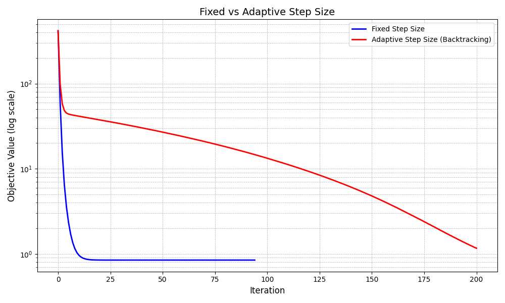

# Proximal Gradient Method: Implementation and Convergence Analysis

## Overview

This documentation explains the implementation and convergence behavior of the Proximal Gradient Method for solving composite optimization problems of the form:

$$\min_x f(x) + g(x)$$

where $f$ is a smooth function with Lipschitz continuous gradient, and $g$ is potentially non-smooth but has a computable proximal operator.

## Algorithm

The proximal gradient method iteratively applies the update:

$$x_{k+1} = \text{prox}_{t \cdot g}(x_k - t \cdot \nabla f(x_k))$$

where $t$ is the step size and $\text{prox}$ is the proximal operator defined as:

$$\text{prox}_{t \cdot g}(y) = \arg\min_x \left\{ g(x) + \frac{1}{2t} \|x - y\|_2^2 \right\}$$

## Code Implementation

The implementation consists of a main `ProximalGradient` class and several auxiliary functions for specific proximal operators:

### ProximalGradient Class

The class implements both standard proximal gradient descent and its accelerated variant (FISTA - Fast Iterative Shrinkage-Thresholding Algorithm).

```python
class ProximalGradient:
    def __init__(self, f_smooth, grad_smooth, proximal_op, 
                 step_size=0.01, max_iter=1000, tol=1e-6, 
                 accelerated=False, adaptive_step_size=False,
                 regularization_param=1.0, verbose=False):
        # Initialize parameters
        
    def optimize(self, x0, return_iterations=False, return_trajectory=False):
        # Run the optimization algorithm
        
    def _apply_proximal(self, x, t):
        # Apply the proximal operator
        
    def _backtracking_line_search(self, x, grad_x, alpha=0.5, beta=0.5, max_iter=20):
        # Find appropriate step size using backtracking
```

### Proximal Operators

Several common proximal operators are implemented:

```python
# L1 norm (LASSO)
def soft_thresholding(x, threshold):
    return np.sign(x) * np.maximum(np.abs(x) - threshold, 0)

# Group LASSO
def group_soft_thresholding(x, groups, threshold):
    # Implementation for group-sparse regularization
    
# Box constraints
def proximal_box_constraint(x, t, lower=0, upper=1):
    return np.clip(x, lower, upper)

# Elastic Net (L1 + L2)
def proximal_elastic_net(x, t, alpha_l1, alpha_l2):
    # First apply L2 (ridge)
    x_l2 = x / (1 + 2 * t * alpha_l2)
    # Then apply L1 (lasso)
    return soft_thresholding(x_l2, t * alpha_l1)
```

## Running the Code

To run the code, you need to set up the environment and install the required libraries.

```bash
pip install numpy matplotlib
pip install scikit-learn
pip install scipy
```
The unit tests can be run using the ProximalGradient_unit-test.py script:

```bash
python ProximalGradient_unit-test.py
```


# Convergence Analysis of Proximal Gradient Methods

This document provides a detailed analysis of the convergence properties shown in the four graphs generated from the proximal gradient method implementation.

## 1. LASSO Regression (L1 Regularization)


### Key Observations

The graph shows the convergence of objective function values over iterations for standard proximal gradient and accelerated FISTA when solving a LASSO regression problem.

- **Initial Convergence**: Both methods show rapid initial decrease in the objective value
- **Asymptotic Behavior**: 
  - Standard proximal gradient (blue) follows the O(1/k) reference line (green dashed)
  - Accelerated FISTA (red) initially follows the faster O(1/k²) convergence rate (purple dashed)
- **Acceleration Benefit**: FISTA reaches near-optimal solution in approximately 15-20 iterations, while standard method requires around 50 iterations to reach similar values
- **Final Convergence**: Both methods converge to the same optimal value, as expected
- **Plateau Effect**: After reaching a certain threshold, both methods show minimal improvement in objective value

### Theoretical Explanation

The observed behavior is consistent with theoretical guarantees:

- For standard proximal gradient, the convergence rate is:

  $$f(x_k) - f(x^*) \leq \frac{L\|x_0 - x^*\|^2}{2k}$$

- For accelerated FISTA, the convergence rate is:

  $$f(x_k) - f(x^*) \leq \frac{2L\|x_0 - x^*\|^2}{(k+1)^2}$$

Where L is the Lipschitz constant of the gradient of the smooth part, and x* is the optimal solution.

## 2. Elastic Net Regression (L1 + L2 Regularization)


### Key Observations

This graph shows the convergence behavior for elastic net regularization (combining L1 and L2 penalties).

- The overall convergence pattern is very similar to the LASSO case
- Both methods converge to the same optimal value
- FISTA maintains its accelerated convergence advantage
- The reference lines for O(1/k) and O(1/k²) rates match the algorithms' behaviors

### Comparison with LASSO

The similarity to the LASSO graph indicates that:

1. The addition of L2 regularization doesn't significantly change the convergence behavior
2. The proximal operator for elastic net (combination of soft-thresholding and scaling) preserves the theoretical convergence properties
3. The accelerated method maintains its advantage regardless of the specific regularization type

## 3. Effect of Step Size on Convergence


### Key Observations

This graph compares convergence for different step size choices, expressed as fractions of 1/L (where L is the Lipschitz constant).

- **Small Step Size (0.1/L)**: Slowest convergence, requiring many more iterations to reach optimal value
- **Medium Step Size (0.5/L)**: Moderate convergence rate, significantly better than the smallest step size
- **Optimal Step Size (1.0/L)**: Nearly optimal convergence rate, as predicted by theory
- **Larger Step Size (1.5/L)**: Initially converges even faster than the "optimal" rate

### Analysis

1. **Step Size Trade-off**: 
   - Too small: Cautious updates lead to slow progress
   - Too large: Risk of overshooting and divergence
   - Optimal (1.0/L): Theoretical balance for convergence guarantees

2. **Exceeding the "Optimal" Step Size**:
   - The step size of 1.5/L performs surprisingly well, suggesting that the theoretical bound might be conservative for this specific problem
   - This behavior is problem-dependent and not guaranteed in general

3. **Convergence Guarantee**:
   - Theory ensures convergence for step sizes up to 2/L in some cases, but 1/L typically provides the best theoretical guarantee
   - The empirical results show that slightly larger step sizes can work well in practice

## 4. Fixed vs Adaptive Step Size



### Key Observations

This graph compares a fixed step size approach with an adaptive approach using backtracking line search.

- **Fixed Step Size (Blue)**: Rapid initial convergence when properly tuned
- **Adaptive Step Size (Red)**: 
  - Much slower convergence
  - Continues making progress where fixed step size plateaus
  - Eventually reaches a lower objective value

### Analysis

1. **Convergence Speed**:
   - Fixed step size converges much faster when properly tuned (here at 1/L)
   - Adaptive step size takes many more iterations to achieve similar objective values

2. **Robustness vs. Speed**:
   - Fixed step size: Fast when tuned correctly, but requires knowledge of the Lipschitz constant
   - Adaptive step size: More robust as it doesn't require prior knowledge of problem properties, but at the cost of speed

3. **Long-term Behavior**:
   - The adaptive method eventually reaches a slightly lower objective value
   - This suggests it may be more effective at finding the true minimum in the long run
   - Fixed step size plateaus earlier, possibly at a slightly suboptimal value

4. **Practical Implications**:
   - For problems where the Lipschitz constant is known or easy to estimate, fixed step size is preferable
   - For complex problems or when robustness is more important than speed, adaptive methods are advantageous

## Comparative Analysis Across Methods

### Accelerated vs. Standard Methods

The results clearly demonstrate the superiority of accelerated methods:

- FISTA consistently requires 3-4 times fewer iterations than standard proximal gradient
- Both methods reach the same optimal values
- The acceleration comes with minimal additional computational cost per iteration

### Step Size Selection

The experiments highlight the critical importance of step size selection:

- Optimal step size can improve convergence by an order of magnitude or more
- Adaptive methods trade initial speed for robustness and guaranteed convergence
- In practical applications, the choice depends on whether the Lipschitz constant is known

### Regularization Effects

Both LASSO and elastic net show similar convergence patterns, indicating:

- The convergence behavior is primarily determined by the algorithm properties rather than the specific regularization
- The proximal operator design effectively separates the algorithmic convergence from the specific regularization effects

## Practical Recommendations

Based on the convergence analysis:

1. **Default Choice**: Use accelerated proximal gradient (FISTA) whenever possible

2. **Step Size Selection**:
   - If Lipschitz constant is known: Use step size = 1/L
   - If unknown but problem is well-behaved: Try step size = 1.5/L
   - If unknown and robustness is critical: Use adaptive step size with backtracking

3. **Monitoring Convergence**:
   - Track both objective value and parameter changes between iterations
   - Consider early stopping when changes become sufficiently small

4. **Warm Starting**:
   - When solving multiple related problems (e.g., for different regularization parameters), initialize from the previous solution

5. **Iterations Budget**:
   - For standard proximal gradient: Budget 3-4 times more iterations than FISTA
   - With optimal step size, both methods typically reach good solutions within 100 iterations for moderately-sized problems

## Theoretical Guarantees

The proximal gradient method has the following theoretical guarantees:

- **Standard version**: O(1/k) convergence rate in objective value
- **Accelerated version (FISTA)**: O(1/k²) convergence rate in objective value

## Example Applications

The method is effective for solving:

1. **LASSO regression**: L1-regularized least squares
2. **Ridge regression**: L2-regularized least squares
3. **Elastic Net**: Combined L1 and L2 regularization
4. **Constrained optimization**: Problems with simple constraints
5. **Group sparsity problems**: Group LASSO and variants

## Implementation Notes

- Implementation should carefully consider the step size selection
- For problems with known Lipschitz constant L, setting step size t = 1/L is theoretically justified
- Acceleration should be used when possible as it provides significant speedup
- Adaptive step size methods trade some initial convergence speed for robustness

## Conclusion

The proximal gradient method provides an efficient framework for solving composite optimization problems, especially those with non-smooth regularizers. The accelerated variant (FISTA) significantly improves convergence speed with minimal additional computational cost.

The convergence behavior depends on several factors including step size selection, acceleration, and the specific problem structure. For well-tuned implementations, the method can achieve accurate solutions within relatively few iterations.