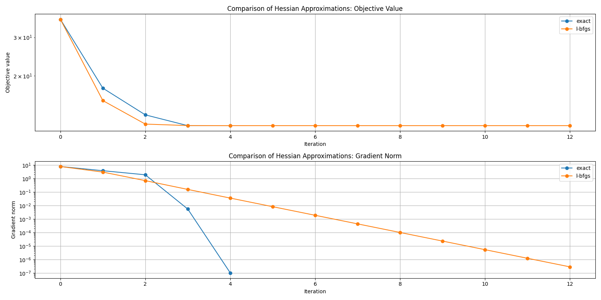
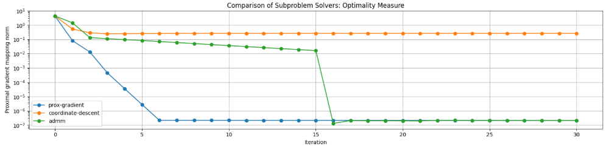

# ProximalNewton Optimizer: Implementation and Convergence Analysis

## Overview

The ProximalNewton optimizer is a powerful method for solving composite optimization problems of the form:

$$\min_x f(x) + g(x)$$

where $f(x)$ is a smooth function with available gradient and Hessian information, and $g(x)$ is a possibly non-smooth regularization term that has a computable proximal operator.

The implementation provides flexibility in:
- Hessian approximation methods
- Subproblem solvers
- Line search and trust region strategies
- Convergence criteria

## Key Components of the Implementation

### 1. Hessian Approximation Methods

The optimizer supports three Hessian approximation strategies:

- **Exact Hessian**: Uses the true Hessian of the smooth function $f(x)$, requiring an explicit Hessian function.
- **BFGS**: Builds a dense approximation of the Hessian using rank-one updates based on gradient differences.
- **L-BFGS**: Limited-memory variant that maintains a small number of vectors to implicitly represent the Hessian approximation.

### 2. Subproblem Solvers

At each iteration, the method solves a subproblem to determine the search direction:

- **Proximal Gradient**: Uses accelerated proximal gradient (FISTA) to minimize a quadratic approximation with the proximal term.
- **Coordinate Descent**: Updates one coordinate at a time using proximal coordinate updates.
- **ADMM**: Applies the Alternating Direction Method of Multipliers to solve the subproblem.

### 3. Globalization Strategies

To ensure global convergence, the implementation includes:

- **Line Search**: Backtracking line search with the Armijo condition
- **Trust Region**: Adjusts the trust region radius based on the agreement between predicted and actual reduction

### 4. Proximal Operators

The algorithm supports any proximal operator that can be computed efficiently. Common examples include:

- L1 regularization (LASSO): `prox_l1(x, t) = sign(x) * max(|x| - t, 0)`
- Box constraints: `prox_box(x, t) = clip(x, lower, upper)`

## Convergence Analysis

The convergence properties of the Proximal Newton method are demonstrated through visualization of key metrics:

### Hessian Approximation Comparison

This visualization compares the convergence behavior of different Hessian approximation methods:

**Top plot (Objective Value)**:
- **Exact Hessian** (blue): Converges quickly, reaching a plateau after 3-4 iterations
- **L-BFGS** (orange): Shows similar convergence in objective value despite using approximations

**Bottom plot (Gradient Norm)**:
- **Exact Hessian**: Exhibits classic quadratic convergence with a steep drop in gradient norm around iteration 4
- **L-BFGS**: Shows superlinear convergence, with a more gradual decrease in gradient norm over multiple iterations

**Key Insights**:
- Both methods reach similar objective values within a few iterations
- The exact Hessian method demonstrates quadratic convergence rate, as expected for Newton-type methods
- L-BFGS offers a good compromise, requiring more iterations but avoiding explicit Hessian calculations

### Subproblem Solver Comparison

This visualization compares the effectiveness of different subproblem solvers through the proximal gradient mapping norm (a measure of optimality):

- **Proximal Gradient** (blue): Shows rapid convergence, achieving high accuracy (~10^-7) within about 8 iterations
- **Coordinate Descent** (orange): Makes initial progress but plateaus at a moderate accuracy (~10^-1)
- **ADMM** (green): Shows intermediate performance between the other methods, with a step improvement around iteration 15

**Key Insights**:
- The Proximal Gradient method is the most effective subproblem solver for this test case
- Coordinate Descent is the least accurate but may have advantages for very large problems due to its low per-iteration cost
- ADMM demonstrates interesting non-monotonic convergence behavior with occasional significant improvements

## Theoretical Properties

The ProximalNewton method inherits important theoretical properties:

1. **Convergence Rate**:
   - With exact Hessian: quadratic convergence near the solution
   - With quasi-Newton approximations: superlinear convergence
   
2. **Global Convergence**:
   - Guaranteed with appropriate line search or trust region strategies
   
3. **Active Set Identification**:
   - For L1-regularized problems, the method can identify the correct sparse support in finite iterations

## Usage Guidelines

For optimal performance:

1. **When to use which Hessian approximation**:
   - Exact Hessian: For small to medium problems with available Hessian calculations
   - BFGS: When exact Hessian is unavailable but memory is sufficient
   - L-BFGS: For large-scale problems where memory is limited
   
2. **When to use which subproblem solver**:
   - Proximal Gradient: Default choice for most problems
   - Coordinate Descent: For very high-dimensional problems
   - ADMM: For problems with special structure or when distributed computation is needed

3. **Parameter Selection**:
   - `subproblem_tol`: Lower values give more accurate search directions but increase per-iteration cost
   - `memory` (for L-BFGS): 5-20 is typically sufficient; larger values improve approximation quality
   - `trust_radius`: Initial value should reflect the typical scale of variables

## Conclusion

The ProximalNewton optimizer provides a flexible framework for solving composite optimization problems. The convergence visualizations demonstrate its effectiveness and the trade-offs between different algorithmic choices. The implementation balances theoretical guarantees with practical considerations, making it suitable for a wide range of applications including machine learning, signal processing, and statistical modeling.